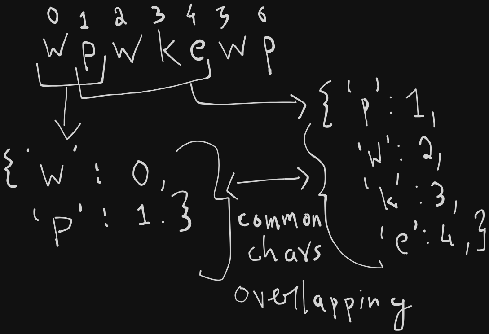

# Problem Definition

**Leetcode Link:** [Longest Substring without Repetitions](https://leetcode.com/problems/longest-substring-without-repeating-characters/description/)

Given a string s, find the length of the longest substring without repeating characters.

Example 1:
```
Input: s = "abcabcbb"
Output: 3
Explanation: The answer is "abc", with the length of 3.
```

Example 2:
```
Input: s = "bbbbb"
Output: 1
Explanation: The answer is "b", with the length of 1.
```
Example 3:
```
Input: s = "pwwkew"
Output: 3
Explanation: The answer is "wke", with the length of 3.
Notice that the answer must be a substring, "pwke" is a subsequence and not a substring.
```

# Approach

- We know that whenever we have to find unique or lookout for repetitions, we need to use a hashmap.
- My first approach was to empty the hashmap every single time I encountered a repitition, which led to extra operations. Why?



- Common characters were overlapping and every single time I emptied the hashmap and ran the left pointer from there, which was extra operations.
- We just need to use our left pointer as an indication of the start of window and the right pointer must go from 0 - end of string.
- For each character at index right, we need to check if it is available in the hashmap, if it is available we also need to check if the index is greater than left i.e within the window, if so then we have a repitition -> in this case we can update the maxLength.
- For every iteration we need to update the hashmap with the index of current element, this way we know the last index of a character in the string.


# Solution

**Time Complexity:** O(N)
**Space Complexity:** O(N)

```python
maxCount = 0
seen = {}
left = right = 0
while right < len(s):
    if s[right] in seen and seen[s[right]] >= left:
        maxCount = max(maxCount, right - left)
        left = seen[s[right]] + 1
    seen[s[right]] = right
    right += 1
maxCount = max(maxCount, right - left)
return maxCount
```