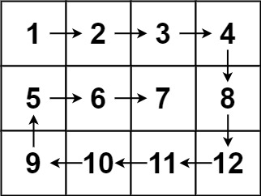
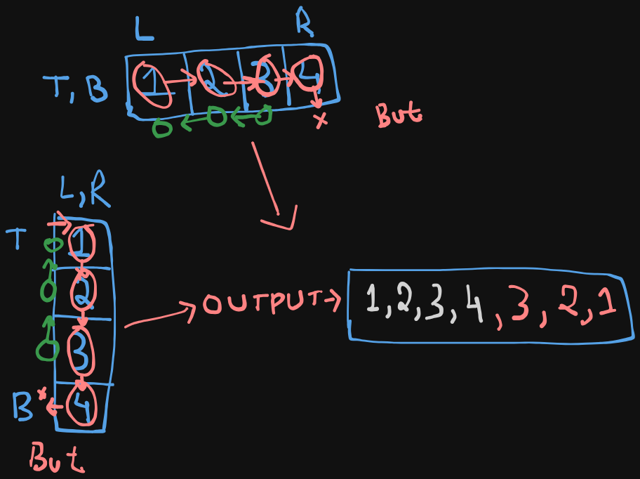

# Problem Definition

**Leetcode Link:** [Spiral Matrix](https://leetcode.com/problems/spiral-matrix/submissions/1383111972/)

**Solution Link:** [Neetcode](https://www.youtube.com/watch?v=BJnMZNwUk1M)

Given an m x n matrix, return all elements of the matrix in spiral order.

Example 1:


```
Input: matrix = [[1,2,3],[4,5,6],[7,8,9]]
Output: [1,2,3,6,9,8,7,4,5]
```

Example 2:


```
Input: matrix = [[1,2,3,4],[5,6,7,8],[9,10,11,12]]
Output: [1,2,3,4,8,12,11,10,9,5,6,7]
```

# Approach

- One thing we can notice is we have some repeating operations if we take a spiral.
1. left to right
2. top to bottom
3. right to left
4. bottom to top
- Since we have these constant operations, we can take 4 variables - top, bottom, left and right.
1. top const -> left to right
    -> top ++
2. right const -> top to bottom
    -> right --
3. bottom const -> right to left
    -> bottom --
4. left const -> bottom to top
    -> left ++
- Consider the edge cases where we have a single row or single column. The first 2 steps work because we are going right and then down. 
- If it was a single row then it would go right and then there is nothing to go down for and the loop ends but if we didn't have a check to see if we are going right to left in the same row we came right from we'll end up with wrong input.
- The same happens for single column case.



# Solution

**Time Complexity:** O(m.n)

**Space Complexity:** O(1)

```python
res = []
top = 0
bottom = len(matrix) - 1
left = 0
right = len(matrix[0]) - 1

while left <= right and top <= bottom:
    for i in range(left, right + 1):
        res.append(matrix[top][i])
    top += 1
    for i in range(top, bottom + 1):
        res.append(matrix[right][i])
    right -= 1
    if not (left <= right and top <= bottom):
        break
    for i in range(right, left - 1, -1):
        res.append(matrix[bottom][i])
    bottom += 1
    for i in range(bottom, top - 1, -1):
        res.append(matrix[i][left])
    left += 1
return res
```