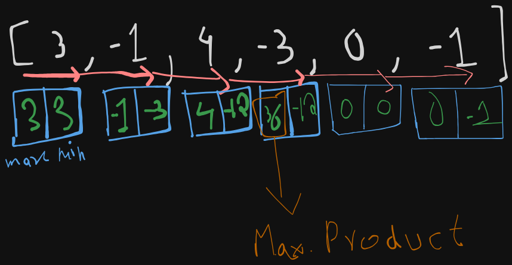

# Problem Definition

**Leetcode Link:** [Maximum Product Subarray](https://leetcode.com/problems/maximum-product-subarray/)

Given an integer array nums, find a 
subarray
 that has the largest product, and return the product.

The test cases are generated so that the answer will fit in a 32-bit integer.

 

Example 1:
```
Input: nums = [2,3,-2,4]
Output: 6
Explanation: [2,3] has the largest product 6.
```

Example 2:
```
Input: nums = [-2,0,-1]
Output: 0
Explanation: The result cannot be 2, because [-2,-1] is not a subarray.
```

# Approach

Let's take some cases:

**Case-1:** If all elements are +ve
- Maximum product will be the product of `all` elements

**Case-2:** If we have a combination of +ve & -ve
1. **Case-2.1:** If even number of -ve elements
   - Maximum product will again be product of `all` elements.
2. **Case-2.2:** If odd number of -ve elements
   - Then we have a problem.

**Case-3:** If we have a combination of +ve, -ve & 0
- We just have to ignore the 0 and reinitialise the sum.

Let's talk about the solution that I saw.

We know that at every step to determine the max product we need to either multiply the `curElement` with the product max till this position or multiply the `curElement` with the product min till this position or it can be neither of them but the current element.

**Let's take an example:**



> #### Note:
> `curMax`, `curMin` is updated every step and `curMax` represents the `max. product` seen till far.

# Solution

**Time Complexity:** O(N)
**Space Complexity:** O(1)

```python
res = nums[0]
curMax = 1
curMin = 1
for num in nums:
    temp = (num * curMax, num * curMin, num)
    curMax = max(temp)
    curMin = min(temp)
    res = max(res, curMax)
return res
```