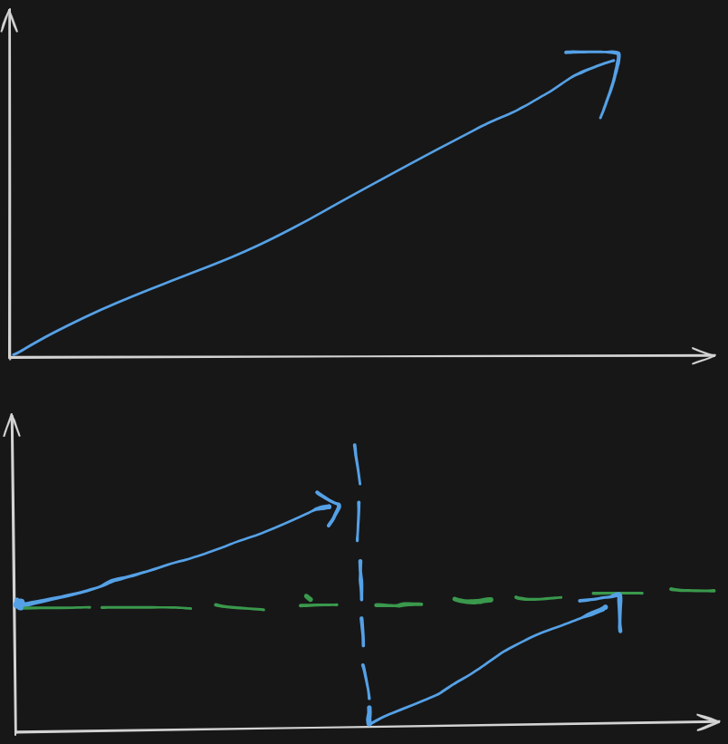

# Problem Definition

**Leetcode Link:** [Search Rotated Sorted Array](https://leetcode.com/problems/search-in-rotated-sorted-array/description/)
**Solution Link:** [Neetcode](https://www.youtube.com/watch?v=U8XENwh8Oy8)

There is an integer array nums sorted in ascending order (with distinct values).

Prior to being passed to your function, nums is possibly rotated at an unknown pivot index k (1 <= k < nums.length) such that the resulting array is [nums[k], nums[k+1], ..., nums[n-1], nums[0], nums[1], ..., nums[k-1]] (0-indexed). For example, [0,1,2,4,5,6,7] might be rotated at pivot index 3 and become [4,5,6,7,0,1,2].

Given the array nums after the possible rotation and an integer target, return the index of target if it is in nums, or -1 if it is not in nums.

You must write an algorithm with O(log n) runtime complexity.

Example 1:
```
Input: nums = [4,5,6,7,0,1,2], target = 0
Output: 4
```
Example 2:
```
Input: nums = [4,5,6,7,0,1,2], target = 3
Output: -1
```
Example 3:
```
Input: nums = [1], target = 0
Output: -1
```

# Approach

Since in the problem def'n they have explicitly asked for a solution with O(log n), we all know what this means - `Binary Search`

But we have a problem the array is sorted but it was rotated so it means we have two sets of sorted array that are on opposite sides.

**1st: Sorted
2nd: Rotated Sorted**



We can see a pattern here both the parts are sorted but are swapped and at the wrong side. When we have a mid, first thing we need to check is which side is sorted - `left or right`. After that let's say the left was sorted, then we check if target is in between left pointer and the mid pointer, if it is then you need to search left half, if not the right half. Similar checks if it was the right side.

```
if left sorted?
    if arr[left] <= target < arr[mid]
        search left half
    else
        search right half
else right sorted?
    if arr[mid] < target <= arr[right]
        search right half
    else
        serach left half
```

# Solution

**Time Complexity:** O(log n)
**Space Complexity:** O(1)

```python
low = 0
high = len(nums) - 1
while low <= high:
    mid = (low + high) // 2
    if arr[mid] == target:
        return mid
    # Left sorted?
    elif arr[low] <= arr[mid]:
        if arr[low] <= target < arr[mid]:
            high = mid - 1
        else:
            low = mid + 1
    # Right sorted?
    else:
        if arr[mid] < target <= arr[high]:
            low = mid + 1
        else:
            high = mid - 1
return -1 # not found
```