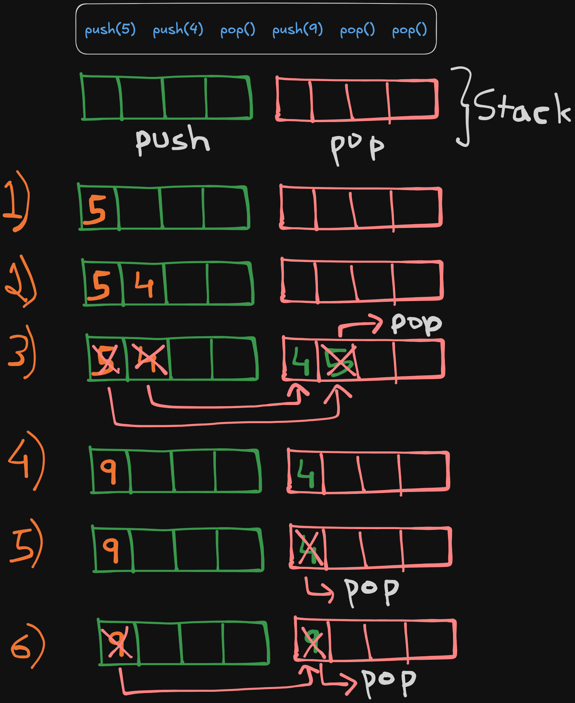

# Problem Description

**Leetcode Link:** [Implement Queue using Stacks](https://leetcode.com/problems/implement-queue-using-stacks/description/)

**Solution Link:** [Neetcode](https://www.youtube.com/watch?v=eanwa3ht3YQ)

Implement a first in first out (FIFO) queue using only two stacks. The implemented queue should support all the functions of a normal queue (push, peek, pop, and empty).

**Implement the MyQueue class:**

- void push(int x) Pushes element x to the back of the queue.
- int pop() Removes the element from the front of the queue and returns it.
- int peek() Returns the element at the front of the queue.
- boolean empty() Returns true if the queue is empty, false otherwise.

**Notes:**

- You must use only standard operations of a stack, which means only push to top, peek/pop from top, size, and is empty operations are valid.
- Depending on your language, the stack may not be supported natively. You may simulate a stack using a list or deque (double-ended queue) as long as you use only a stack's standard operations.
 

Example 1:
```
Input
["MyQueue", "push", "push", "peek", "pop", "empty"]
[[], [1], [2], [], [], []]
Output
[null, null, null, 1, 1, false]

Explanation
MyQueue myQueue = new MyQueue();
myQueue.push(1); // queue is: [1]
myQueue.push(2); // queue is: [1, 2] (leftmost is front of the queue)
myQueue.peek(); // return 1
myQueue.pop(); // return 1, queue is [2]
myQueue.empty(); // return false
```

# Approach

**Brute:**
- We can make use of both the stacks. We can notice that when we push to queue we need a stack store that as both stack and queue have same push operation. When popping we need to empty the contains of the first stack and push it to secodn stack by popping from stack 1 and pushing to stack2.
- If we do that we will get our queue's head where the top of stack2 is so we can easily pop from stack (queue).
- But we should also know that if there is a push operation after this then to tackle it we need to do the same thing bur from stack 2 to stack 1 now.
- So we can use the stack1 as push stack and stack2 as pop stack.
- push: O(1) and pop: O(n)

**My Approach(sub-optimal):**
- I noticed a pattern where if we are only pushing then we can keep pushing to push stack, but when we are popping we need to pop from push stack and populate the pop stack and then pop, after this again populate the stack1 again after pop.
- But I felt the last operation redundant as if we had another pop operation after this then we need to do the same thing once again but what we need to observe is that the contents of the pop stack will be the same as previous pop operation.
- What I did was everytime I pushed I checked if the push stack was empty that means that there is some contents in pop stack and we need to push it back to push stack so that we can append right.
- When I pop, I have to check if the pop stack was empty that means there is some contents in pop stack we can pop and we need to populate the pop stack.
- This would be amortized O(1) but not worst case O(1) pop as the follow up suggested but it was not actually and I had some redundant operations.

**Optimal:**
- What I failed to see was the above solution was half right, what I got wrong was the part where I was checking if the push stack was empty and re-populate it from pop stack.
- That was useless because what you append even to the empty stack is and will be in order with pop stack. So what we ought to do is to only check if our pop stack is empty and populate it.

 

- we can see that the populating is only happening from push to pop and not also from pop stack to push. which was redundant.

# Solution

```python
class MyQueue:
    def __init__(self):
        self.pushStack = []
        self.popStack = []

    def push(self, x: int) -> None:
        self.pushStack.append(x)

    def pop(self) -> int:
        if not self.popStack:
            while self.pushStack:
                self.popStack.append(self.pushStack.pop())
        return self.popStack.pop()

    def peek(self) -> int:
        # we could have accessed pushStack[0] but that is not a stack operation hence this workaround.
        if not self.popStack:
            while self.pushStack:
                self.popStack.append(self.pushStack.pop())
        return self.popStack[-1]

    def empty(self) -> bool:
        return not self.pushStack and not self.popStack
```