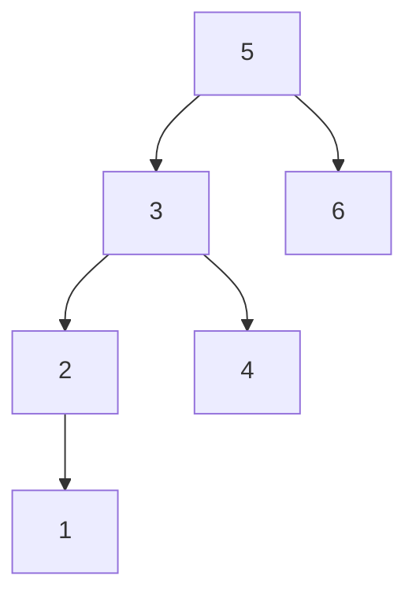

# Problem Description

**Leetcode Link:** [Lowest Common Ancestor](https://leetcode.com/problems/lowest-common-ancestor-of-a-binary-search-tree/description/)

**Solution Link:** [Neetcode](https://www.youtube.com/watch?v=gs2LMfuOR9k)

Given a binary search tree (BST), find the lowest common ancestor (LCA) node of two given nodes in the BST.

According to the definition of LCA on Wikipedia: “The lowest common ancestor is defined between two nodes p and q as the lowest node in T that has both p and q as descendants (where we allow a node to be a descendant of itself).”

Example 1:


```
Input: root = [6,2,8,0,4,7,9,null,null,3,5], p = 2, q = 8
Output: 6
Explanation: The LCA of nodes 2 and 8 is 6.
```
Example 2:


```
Input: root = [6,2,8,0,4,7,9,null,null,3,5], p = 2, q = 4
Output: 2
Explanation: The LCA of nodes 2 and 4 is 2, since a node can be a descendant of itself according to the LCA definition.
```
Example 3:
```
Input: root = [2,1], p = 2, q = 1
Output: 2
```

# Approach

- I made some assumptions in this problem which led to me ignoring the edge cases and it also helped me get the idea of the solution.
- What I assumed from the examples was the ancestors would be only one level apart like in Example-2, which was *ahem* wrong.
- My initial approach was as we know that the p and q are like a level apart we can determine the root of these two nodes and compare them, if they are equal then that is the ancestor.
- If they aren't the same then we check if one of the node's val is either less than both or greater than both then we know the ancestor is the other node because it is BST the ancestor will always be between p and q or be p or q itself as they also mentioned that each node can be its own descendant.
- This works for the test cases they gave above but fails miserably for the example I give below.



given, p = 1 and q = 4, what do you think my code returned? It returned 2, since both parents of 1 and 4 are in the range and it encountering parent of 1 first made it to return 2.

- I still coudv'e made it somehow work by adding another if case probably, but while I was doing this I noticed that when we traversed we always traversed based on both the values for example when traversing from 5 to its children 3 and 6 we checked if the values of p and q were lesser than 5 and they were so we moved left. 
- As soon as we reach a node that is in between p and q and not outside the range we can conclude that this is the ancestor node that holds both p and q. 

> **NOTE:** We need to know that the binary tree in this Q is a BST.
> **TIP:** For traversing a BST we don't really need recursion.

# Solution

**Time Complexity:** O(h), where h is the height of the tree.

**Space Compelxity:** O(h)

```python
cur = root
while cur:
    if p.val > cur.val and q.val > cur.val:
        cur = cur.right
    elif p.val < cur.val and q.val < cur.val:
        cur = cur.left
    else:
        return cur
```